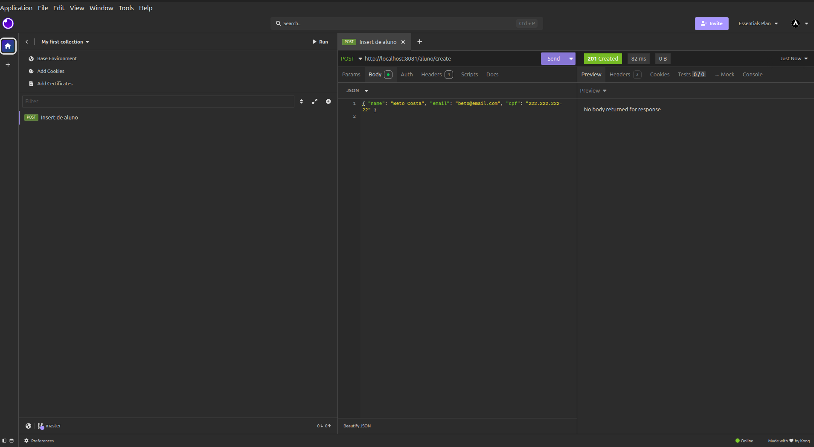
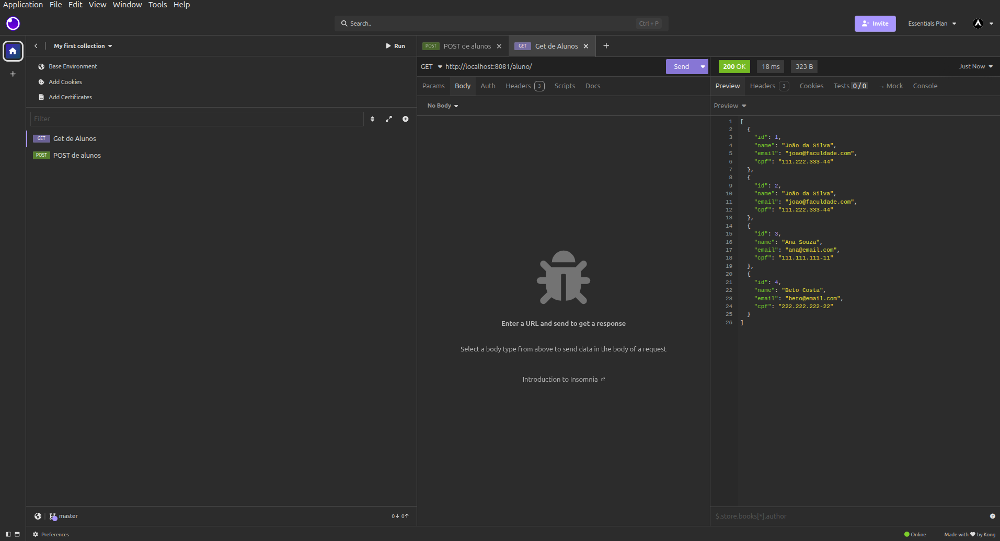
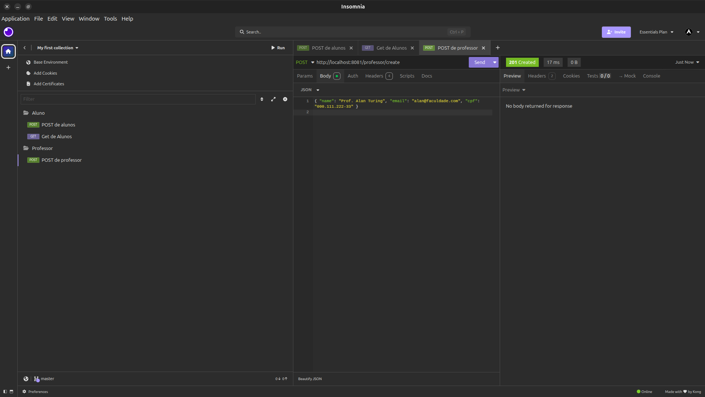
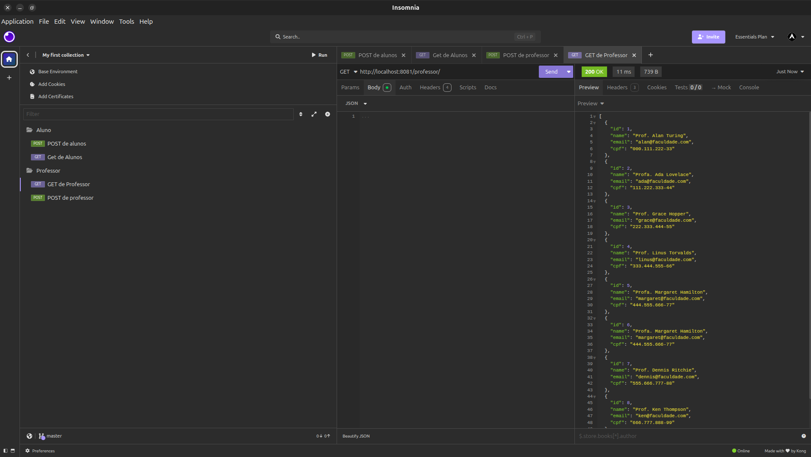
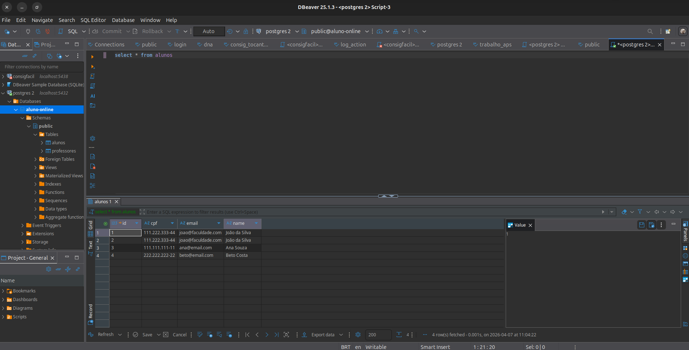
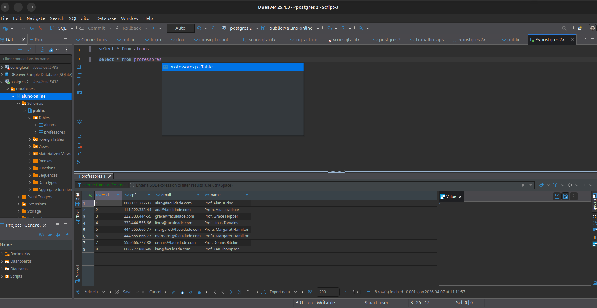

# Aluno Online API 🎓

Sistema de gestão escolar simples para o gerenciamento de registros de alunos e professores, desenvolvido como trabalho acadêmico utilizando **Spring Boot 3** e **PostgreSQL**.

---

## 📖 Explicação do Projeto
A **Aluno Online API** é uma plataforma de backend voltada para a gestão de cadastros básicos de uma instituição de ensino. O objetivo é permitir que administradores realizem operações de criação, consulta, atualização e remoção (CRUD) de alunos e professores de forma rápida e eficiente através de uma interface REST.

## 🏗️ Arquitetura Utilizada
O projeto foi desenvolvido seguindo o padrão de **Arquitetura em Camadas (Multitier Architecture)**, garantindo a separação de responsabilidades:

1.  **Camada de Modelo (Entities)**: Define a estrutura dos dados que são persistidos no banco.
2.  **Camada de Repositório (Repositories)**: Interface de comunicação direta com o banco de dados via Spring Data JPA.
3.  **Camada de Serviço (Services)**: Onde reside a lógica de negócio da aplicação.
4.  **Camada de Controle (Controllers)**: Responsável por gerenciar as rotas da API e as requisições HTTP.

---

## 🔍 Detalhamento do Código

*   **`Aluno` / `Professor` (Models)**: Classes que utilizam as anotações do JPA (`@Entity`) para mapear as tabelas no PostgreSQL. O uso do **Lombok** simplifica o código, gerando Getters e Setters automaticamente.
*   **`AlunoRepository` / `ProfessorRepository`**: Interfaces que estendem o `JpaRepository`, permitindo operações complexas de banco de dados sem a necessidade de escrever SQL manualmente.
*   **`AlunoService` / `ProfessorService`**: Classes anotadas com `@Service` que encapsulam as regras de negócio antes dos dados serem enviados ao repositório.
*   **`AlunoController` / `ProfessorController`**: Gerenciam os protocolos HTTP (POST, GET, PUT, DELETE). Utilizamos a anotação `@RequestBody` para transformar o JSON enviado pelo cliente em objetos Java.

---

## ⚙️ Como Executar

1.  **Banco de Dados**: Certifique-se de ter o PostgreSQL rodando e crie o banco:
    ```bash
    psql -U postgres -c "CREATE DATABASE \"aluno-online\";"
    ```
2.  **Configuração**: Ajuste a senha em `src/main/resources/application.properties`.
3.  **Execução**:
    ```bash
    ./mvnw spring-boot:run
    ```
    *A API estará disponível em: `http://localhost:8081`*

---

## 📸 Evidências de Testes

### **Testes no Insomnia (Requisições)**

#### Cadastro de Aluno (POST)


#### Listagem de Alunos (GET)


#### Cadastro de Professor (POST)


#### Listagem de Professores (GET)


---

### **Visualização no DBeaver (Banco de Dados)**

#### Tabela de Alunos


#### Tabela de Professores


---
*Desenvolvido por Artur Medeiros para fins acadêmicos.*
